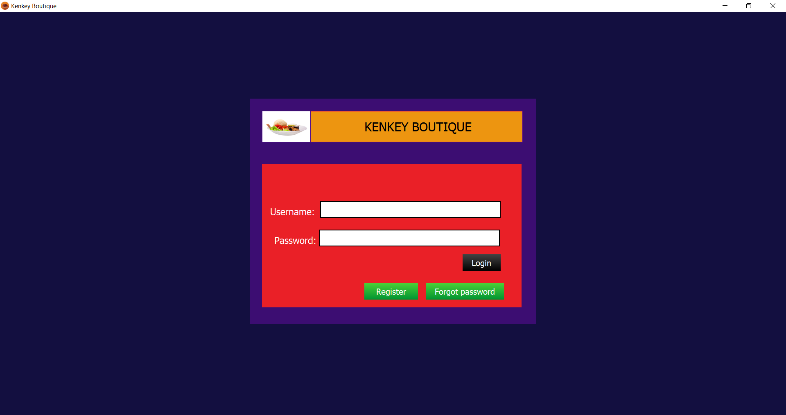
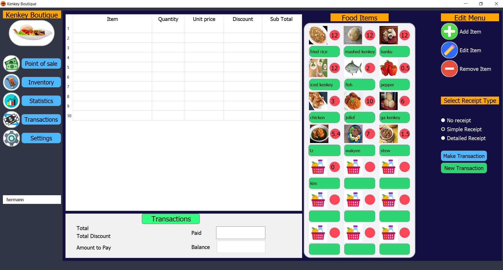
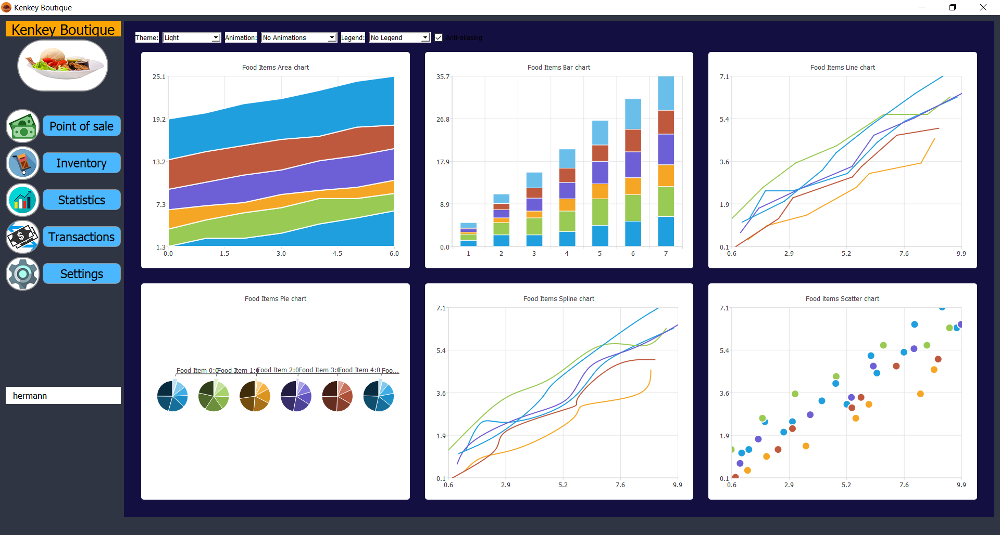

# Kenkey Boutique
Optional course project for Object Oriented Programming at Kwame Nkrumah University of Science and Technology. A restaurant management system built with C++ using QT for the user interface. 

## Features
 - Provides point of sale features
 - Receipts
 - Sales statistics
 - Inventory management
 - Allows you to track sales withing a given period of time. 

## Demo

## Contributing
Pull requests are welcome. For major changes, please open an issue first to discuss what you would like to change.

License
----

MIT &copy; Kumbong Hermann

